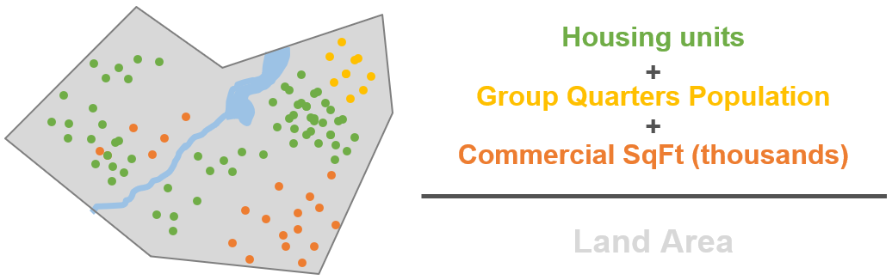
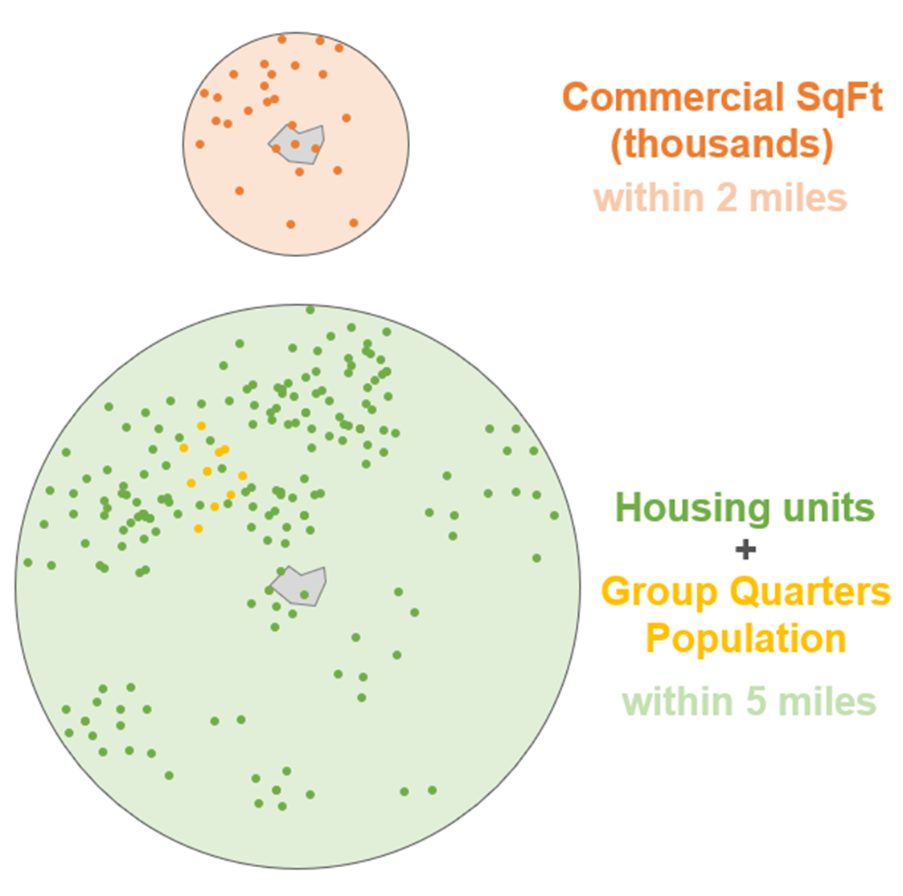
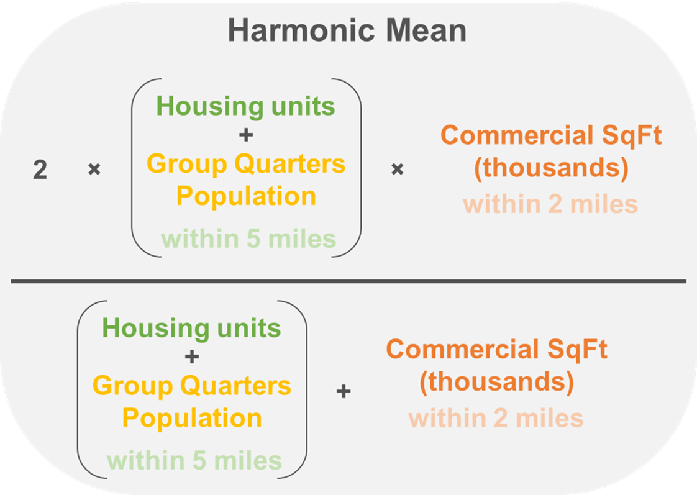
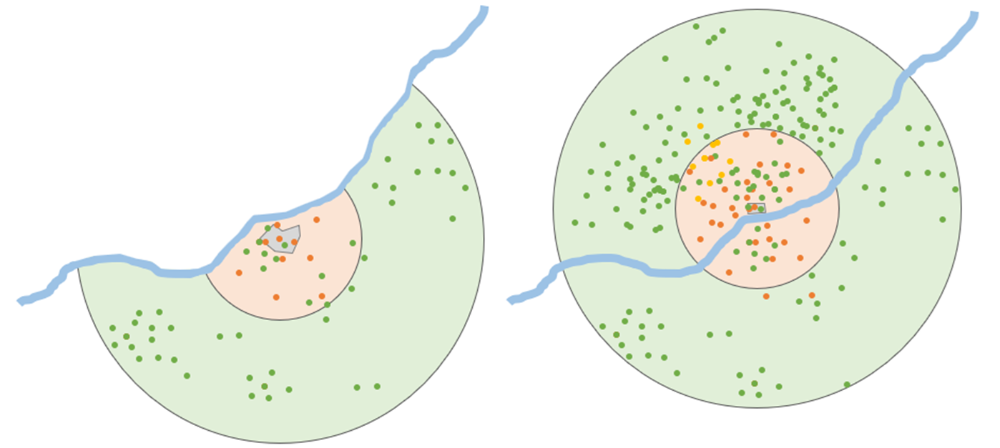
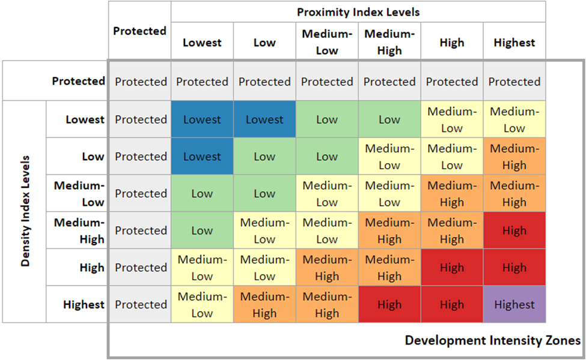

# Methodology

The DIZ methodology was derived from classification methods for “[Area Types](https://github.com/VisionEval/VisionEval/blob/master/sources/modules/VESimLandUse/inst/module_docs/CreateSimBzoneModels.md)” employed in the [VisionEval](https://visioneval.org/) VE-State strategic model. The chief difference is that Area Types use density and proximity measures using the presence of people (i.e. population, households, employment), while DIZ uses the presence of structures (i.e. housing units, commercial square footage). DIZ also breaks density and proximity levels into more classifications, and the overall zone numbers are greater as a result. DIZ integrates an overwrite of block group geographies by water and protected open space polygons, as mentioned, unlike Area Types. Finally, DIZ integrates bonus points for block groups meeting certain criteria using the density of street crossings from DVRPC’s sidewalk network and building heights from CoStar

### Data Sources

The following data sources are used to create the DIZ (vintages subject to change with updates):

##### Block Group-Based Zonal Calculations

* Census 2020 block group shapes
* Census 2020 block centroids with housing unit and group quarters population counts
* [CoStar](https://www.costar.com/) commercial properties’ rentable building area (square footage) and number of stories (subscription data service)
* [DVRPC Sidewalk Inventory](https://catalog.dvrpc.org/dataset/pedestrian-network-lines)

##### Protected Zones

* [DVRPC 2020 Protected Open Space Inventory](https://catalog.dvrpc.org/dataset/protected-open-space)
* [New Jersey Open Space](https://gisdata-njdep.opendata.arcgis.com/datasets/njdep::state-local-and-nonprofit-open-space-of-new-jersey/explore?location=40.132535%2C-74.754550%2C8.99) (beyond DVRPC region)
* [Chesapeake Bay Watershed Open Space](https://gis.chesapeakebay.net/ags/rest/services/ChesapeakeProgress/cpProtectedLands_2018/MapServer) (beyond DVRPC region)
* [Delaware River Basin Open Space](https://www.ccgov.org/government/land-use-development-services/gis/available-gis-data) (beyond DVRPC region)
* [DVRPC 2015 Land Use Inventory ](https://catalog.dvrpc.org/dataset/land-use-2015)for detailed areas of water and other uses that render a block group protected (see below)
* DVRPC Water Bodies
* [US Geological Survey National Hydrography Dataset (NHD)](https://www.usgs.gov/national-hydrography/national-hydrography-dataset)

### Key Dimensions

#### Density Index Levels

The density dimension of the DIZ calculates the density of development within a block group. Housing units plus group quarters population are used for residential development. Group quarters population is population not living in households but at various facility types such as dormitories, military barracks, nursing homes, and correctional facilities. While less than ideal to use a population metric, it is the only data available to reflect these facilities and treats group quarters population as single occupancy units when paired summed housing units. Commercial square footage values are converted to thousands to be on a similar numeric scale and summed with housing units and group quarters population. The sum is divided by the land area of the block group to get a density index value. 

Density index values are then grouped into six bins by various density index ranges, seen below:

* Lowest, 0 - 0.09
* Low, 0.10 - 0.46
* Medium-Low, 0.47 - 1.64
* Medium-High, 1.65 - 4.99
* High, 5.00 - 24.99
* Highest, 25.00 or more

### Proximity Index and Levels

The proximity dimension of the DIZ reflects the fact that development has occurred in nearby areas outside the arbitrary statistical boundaries of block groups. Block group boundaries often divide places by major roads, but those living or working there identify the place by what’s on either side of that road. The proximity measure uses two buffer distances from the center point (centroid) of the block group: 2 miles and 5 miles. These distances represent nearby accessible places and markets. The 2-mile buffer captures the distance residents of the block group might walk or bike to nearby businesses, therefore commercial square footage (in thousands) within the 2-mile buffer is summed. The 5-mile distance represents the nearby market for customers for local businesses within the block group. The 5-mile buffer, therefore, sums the housing units and group quarter population intersecting with the buffer.

To smooth the sums of these unlike distances and unlike items, a statistical formula called the _harmonic mean_ is employed to create the proximity index value. The harmonic mean is calculated by multiplying by 2 the sum of the 2-mile commercial value multiplied by the 5-mile residential value, then dividing that by the sum of the 2-mile commercial value multiplied by the 5-mile residential value.

As a way to acknowledge the barrier to markets and local identities presented by the Delaware River within the region, the DIZ methodology prohibits some buffers from extending over the river to the other state. This is mainly meant to prevent lower density areas on one side of the river to graduate to higher intensity levels when the proximity and density levels are later used to determine development intensity levels. A higher density zone will likely have a higher proximity level and capturing less dense areas in its buffer area will not significantly impact that. However, a lower density area may not have a strong relationship with higher intensity areas across the river. Higher density areas on either side of the river are likely to have greater chances of interactions and relationships. With this in mind, if a zone has a density level of lowest, low, or medium-low, its buffers are cut off by the river, however a medium-high, high, or highest block group density on the opposite side of the river is allowed to capture the development on both sides.

Proximity level names are identical to those used in density levels and are categories for grouping proximity index value ranges. The ranges are as follows: 

* Lowest, 0 - 499
* Low, 500 - 2,099
* Medium-Low, 2,100 - 8,999
* Medium-High, 9,000 - 21,999
* High, 22,000 - 199,999
* Highest, 200,000 or more

### DIZ Levels Matrix

The density level and proximity level classifications of block groups are then placed into a matrix to determine a preliminary DIZ zone classification. The combinations of levels and which zones they get classified into are seen in the matrix diagram below. This also reflects the overriding of Protected zones, despite the underlying block group’s zone.

### Zone Bonuses

After preliminary zones are determined two avenues to graduate to a higher intensity zone are afforded to block groups that meet particular criteria. These bonuses allow for more information about the built form that may not be captured in the density and proximity dimensions due to the shapes of block groups or other factors. 

#### Sidewalk Network Crossings Density

The crossing segments of DVRPC’s Sidewalk Network dataset were used to create a crossings density value for each block group. This was chosen as both an indication of walkability, in showing the presence of pedestrian facilities, and of form, by capturing the frequency of intersections. Intersection density can indicate greater likelihood of street grid connectivity and urbanization. Some crossings in the network were drawn where there are no painted crosswalks but that the sidewalk presence at corners suggests people will likely cross there.Only block groups with a preliminary intensity zone of low, medium-low, and medium-high can receive a sidewalk network crossings density bonus and can only gain the next higher intensity level. The criteria for a bonus is that the block group’s crossing density value is at least higher than the next zone up’s 50th percentile of crossing densities. 

Only 4% of block groups in the 9-county region receive a sidewalk network crossings density bonus. The sidewalk inventory is only available for the DVRPC region and only block groups within the region are eligible for this type of bonus. Since the purpose of the DIZ is for regional analysis and the surrounding county results are for context, this discrepancy was not seen as an issue.

#### A Note on Density Denominators

The denominator for crossings density is not area of land, like the density index for residential and commercial spaces, but the area of the block group minus both land and protected open space areas: the protected zones. This reduces the impact of block groups that are delineated to incorporated large parks or other areas while capturing denser development areas. When a similar denominator was used for development density index values, very rural areas in the Pinelands and elsewhere resulted in implausible densities, so the land area was selected for the denominator. Sidewalk network crossings density did not have the same issue with plausible values.

#### Average Building Height

The average number of stories of the commercial and multifamily buildings in each block group is calculated to determine eligibility for a building height bonus. The only block groups that can be given a bonus for building height are those with a high intensity and the highest proximity level. A block group with an average of 3 or more stories meeting that criteria can graduate to the highest intensity zone. This applies to only X% of block groups, mostly on the periphery of the preliminary highest intensity zone. It captures a few more block groups in University City, and one in the City of Camden, NJ and extends the regional core.

### Final Block Group Result

The final block group-level result for DIZ classifications are the result of the respective bonuses applied to the preliminary DIZ classifications.

#### Determining Thresholds for Density and Proximity Levels 

In the development of the DIZ initial thresholds for density level and proximity level bins were set then continually experimented with until ideas of plausible zone breakpoints were achieved. A variety of external sources of data that capture DVRPC staff and planning partner notions of appropriate breaks were used. It was clear that a block group-based classification inherently would not match up to other sources that did not use block groups, but those other sources were loose benchmarks to guide the threshold work. 

Long-Range Plan Centers helped guide the highest zone at the regional core, as well as various areas with higher intensities than what surrounded them, such as more rural boros that received medium-low or medium-high classifications, while surrounded by low or lowest intensities. The Census 2020 Urban Areas layer guided the divide between low and medium-low, as did the classifications of the New Jersey Planning Areas, and sewer envelope. The DIZ was intended to be a data-driven replacement for the municipality-based geography of Long-Range Plan Planning Areas. LRP Planning Areas were also used as benchmarks, but also showed their limits when compared to the detail of this block group-based geography. 

A draft result of the DIZ geography was shared with members of DVRPC’s Socioeconomic and Land Use Analytics Committee (SLUAC) in early 2023. Feedback was used to further refine the methods and thresholds.

### Protected Areas

A unified layer of protected open space and water areas was created using the sources above to create the protected zone. Early in the  DIZ processing, block groups are ruled out because the Census Bureau assigns zero land area to them. Many are in rivers or bays. Additionally, when the protected zone plus various undevelopable land uses are removed from the area of a block group and the remaining land area is five percent or less of the total polygon, the handful of block groups meeting this criteria are assigned as a part of the protected zone and no density, proximity, or bonus calculations are performed on them. This allows the 50th percentile of sidewalk network density to not include these block groups.

The final step in making the DIZ is to unify the block group zones and protected zones and dissolve all zones into single multi-part features.

### Geographic Translations

The DIZ is a block group-based product, but since it’s intended as a geography to report data and trends by, and not all data conforms to block groups, various geographic translations were created. There are geographic translations of the DIZ to tracts, municipalities, the 18 Philadelphia Planning Districts, and the travel analysis zone (TAZ) geography of the DVRPC travel model. To achieve the translations, the blocks within each block group were assigned their parent zone. A lookup table of blocks to higher geographies was created, and the average of their zone ID numbers (1 - 6, see first table) weighted by block land area was rounded to the nearest whole number, creating the zone ID for the higher geography.

While the translations to higher geographies get more generalized and drop the protected zone, it is assumed that datapoints like population estimates or residential building permit approvals are things that will be occurring in non-protected space.

