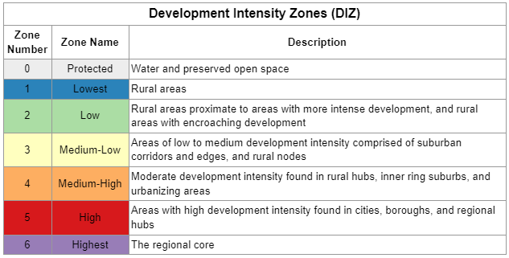

# Development Intensity Zones
## Overview

The Development Intensity Zones (DIZ) geography as a block group-based assessment of existing development, largely formed from two analysis dimensions—density and proximity. Zones are classified from least to greatest development intensity, as follows:




“Protected” zone cuts through the block group-based geographies to overwrite areas of water or protected open space as its own zone. 

The DIZ covers the 9-county DVRPC region, along with surrounding counties for greater context beyond the region.


### Use

The DIZ can be used for a variety of purposes. It provides simple classifications of the region’s areas by which data can be summed and analyzed. It can be used for policy applications, such as incentivising where future growth or investment goes based on smart growth principles. It’s important to note that the DIZ classifications are based on the current presence of development, largely using housing units for residential intensity and commercial square feet for non-residential intensity. This captures used space and space with potential for use (vacant space) and the presence of infrastructure to build buildings, but if one’s analysis is more suited for the presence of people, other metrics such as population, households, and employment may be more appropriate. If future growth in development is desirable for one’s analysis, the DIZ does not capture that.

For more information, see [Methodology](https://github.com/dvrpc/development-intensity-zones/blob/main/Methodology.md).

## To build the DIZ, run these scripts in order

1. analysis.block_groups_24co_2020 create.sql
2. block_groups_24co_2020_area_calcs_create.py - _Warning: This script will take roughly 1 hour and 38 minutes to run, because the calculation of the spatial difference between the block groups and protected open space and water takes a while_
3. block_group_centroids_24co_2020_and_their_buffers_create.py
4. block_centroids_2020_with_2020_decennial_pop_and_hhs_create.py
5. block_group_land_by_developability_create.py - _Warning: This script will take roughly 2 hours and 10 minutes to run, because the intersecting of the block groups with the developable block group fragments takes a while_
6. analysis.unprotected_land_area create.sql
7. crosswalks.sql
8. analysis.block_groups_dvrpc_2020 create.sql
9. crosswalks_block_groups_dvrpc_2020_create.py
10. analysis.crosswalks_density_block_groups_dvrpc_2020.sql
11. analysis.costarproperties_region_plus_surrounding.sql
12. not_in_costar_upload.py - _Ben Gruswitz said how we may need to reevaluate the need for _raw.not_in_costar based on any new additions to Costar data in future downloads. We download a snapshot of Costar data every 6 months (after the 1st and 3rd quarter of each year)_
13. analysis.costarproperties_rentable_area_bg.sql
14. analysis.costar_number_of_stories create.sql
15. analysis.density_index create.sql
16. analysis.incorp_del_river_bg_centroids_24co_2020_buffers create.sql
17. proximity_index_step1_create.py
18. analysis.proximity_index create.sql
19. analysis.diz_block_group_step1 create.sql
20. analysis.crosswalk_density_summary create.sql
21. analysis.diz_block_group create.sql
22. diz_create.py - _Warning: Allow for about 45 minutes for this script to run_
23. analysis.diz_mcd create.sql
24. analysis.diz_taz create.sql
25. analysis.diz_tract create.sql
26. analysis.diz_philadelphia_planning_district create.sql

## Python environment

- Install [miniconda](https://docs.conda.io/en/latest/miniconda.html)
- Open a `conda` command prompt, `cd` into this folder, and run:

```
conda env create -f environment.yml
```

- You can now activate the environment with:

```
conda activate development-intensity-zones
```

- However, then run these 2 commands in order in the terminal, in order to fix an error that comes up later with geopandas (found out how to fix that error from https://stackoverflow.com/a/69642315, which in turn was found on https://stackoverflow.com/questions/69630630/on-fresh-conda-installation-of-pyproj-pyproj-unable-to-set-database-path-pypr ):

```
conda remove --force pyproj
python -m pip install "pyproj"
```

- With the environment activated and fully created for that matter, you can run scripts with:

```
python PATH/TO/FILE.py
```

- You can import functions and classes from other files in this repo like this:

```python
from development_intensity_zones.helpers import do_something


do_something(times=3)
```
