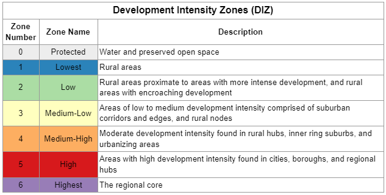

# Development Intensity Zones
## Overview

The Development Intensity Zones (DIZ) geography as a block group-based assessment of existing development, largely formed from two analysis dimensions—density and proximity. Zones are classified from least to greatest development intensity, as follows:



The DIZ covers the 9-county DVRPC region, along with surrounding counties for greater context beyond the region.


### Use

The DIZ can be used for a variety of purposes. It provides simple classifications of the region’s areas by which data can be summed and analyzed. It can be used for policy applications, such as incentivising where future growth or investment goes based on smart growth principles. It’s important to note that the DIZ classifications are based on the current presence of development, largely using housing units for residential intensity and commercial square feet for non-residential intensity. This captures used space and space with potential for use (vacant space) and the presence of infrastructure to build buildings, but if one’s analysis is more suited for the presence of people, other metrics such as population, households, and employment may be more appropriate. If future growth in development is desirable for one’s analysis, the DIZ does not capture that.

For more information, see [Methodology](Methodology.md).

## To build the DIZ

### Requirements
- PostgreSQL w/ PostGIS
- Python 3.x
- .env ([see sample](.env_sample)) with PostgreSQL/ArcGIS Portal credentials and Census key
- [DVRPC data sources](/source/dvrpc_data_sources.json)
- [various other layers and tables as detailed in the Methodology](methodology.md#data-sources)

### Run
1. Clone the repo
    ``` cmd
    git clone https://github.com/dvrpc/development-intensity-zones.git
    ```
2. Create a Python virtual environment with dependencies

    Working in the repo directory from your terminal:

    - create new venv
    ```cmd
    python -m venv venv
    ```
    - activate venv
    ```
    .\venv\scripts\activate
    ```
    - install requirements
    ```
    pip install -r requirements.txt
    ```
3. Start the process
    ```
    python run.py
    ```